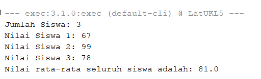

# LatihanUKLSulit1
## Program untuk menghitung nilai rata-rata dari siswa. Jumlah siswa dan nilai-nilai diinput oleh pengguna
Pengguna akan diminta untuk menginput jumlah siswa. Kemudian, pengguna diminta menginput nilai-nilai untuk seluruh siswa tersebut.  
Program memasukkan nilai yang diinput pengguna ke dalam ArrayList, kemudian menjumlahkan semua nilainya menggunakan For loop, dan dibagi dengan jumlah nilai yang ada.

